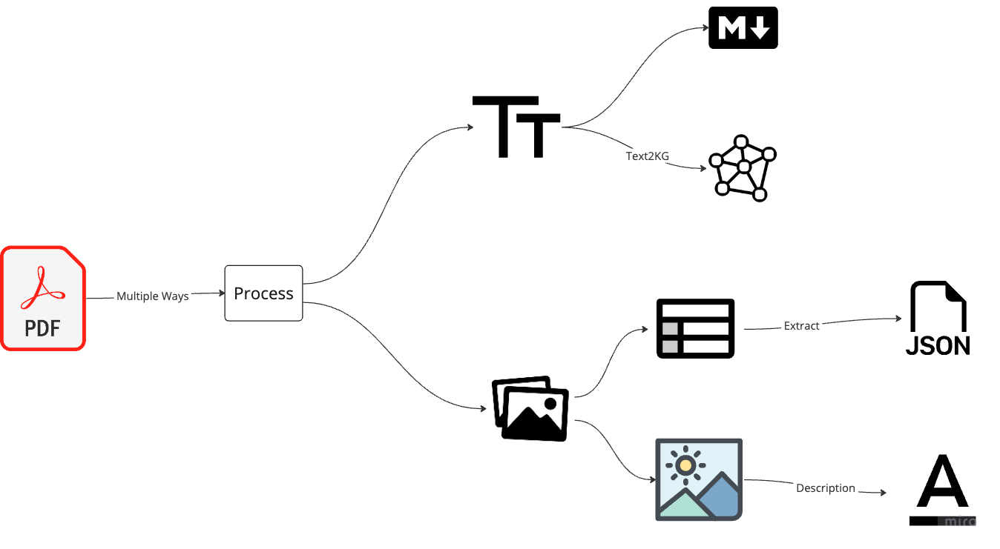

# BlackSwan - Unified Unstructured Data Processing Framework

The generative AI attracts a lot of attention, one of the goal is using it with our own data.
Our data mainly in two forms:

- Unstructured data: text, image
- Structured data: database, csv, etc.

To handle the unstructured data, one of the common approach we do is to get the chunk of text into embeddings, and then
do vector search.
This is the first and naive generation of RAG(Retrieval Augmented Generation).

However, we do want to be able to do the information retrieval under the global context (which includes the structured
data and unstructured data).

So, find a way to unify the structured data and unstructured data, and then do the information retrieval across the
whole data context is an ultimate goal.

So the end of goal of this project is to build a unified framework to allow you to talk with your databases and
documents in a unified way.

## Unstructured Data Processing

Main data under this category is PDF.

So we need to be able to extract the text and images from the PDF.

The overall workflow will be:

