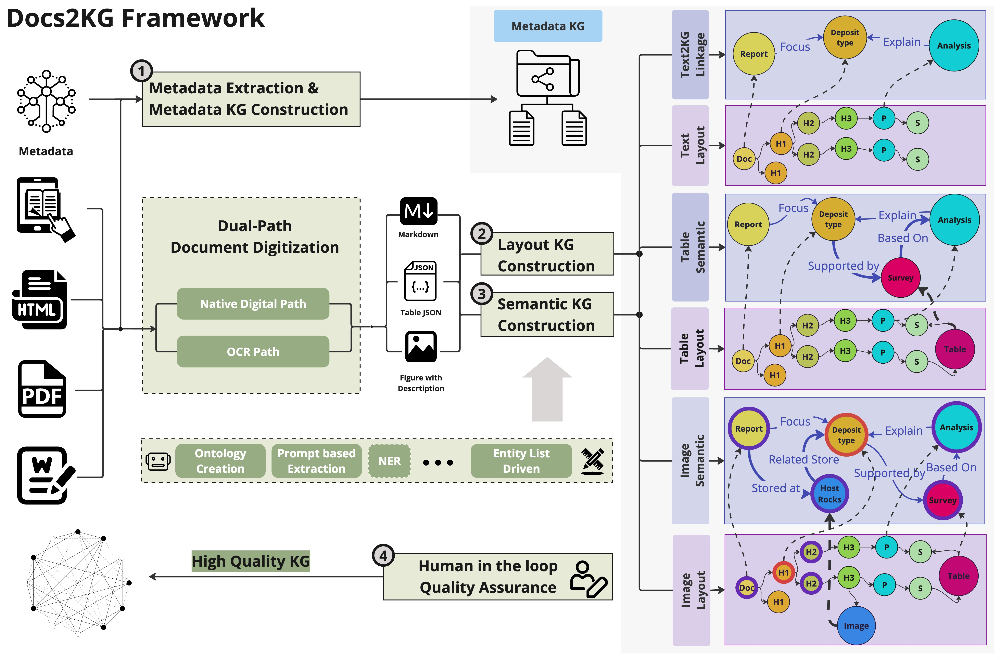
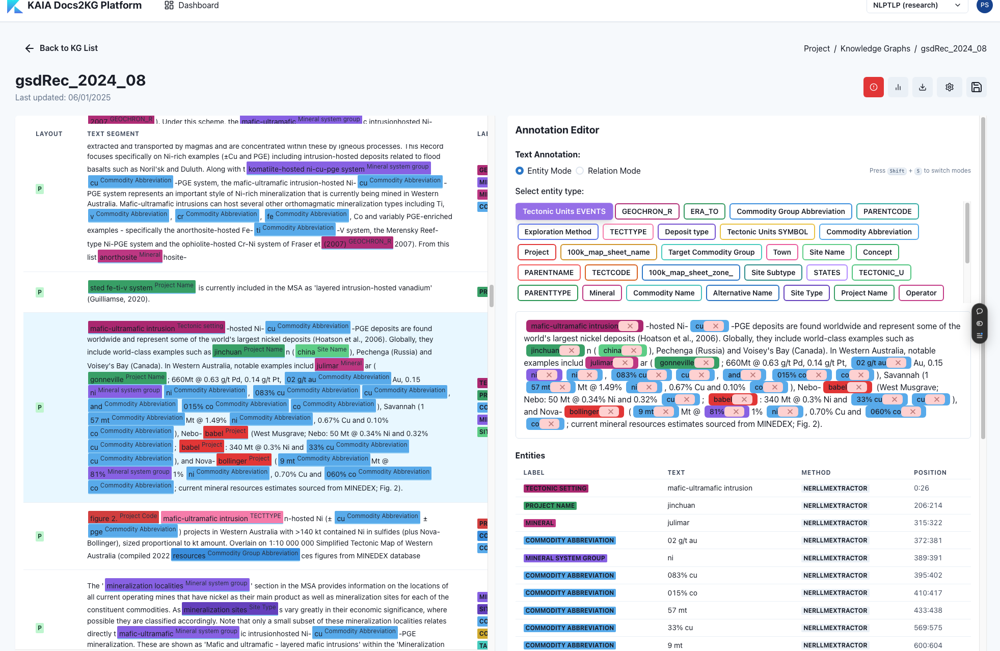
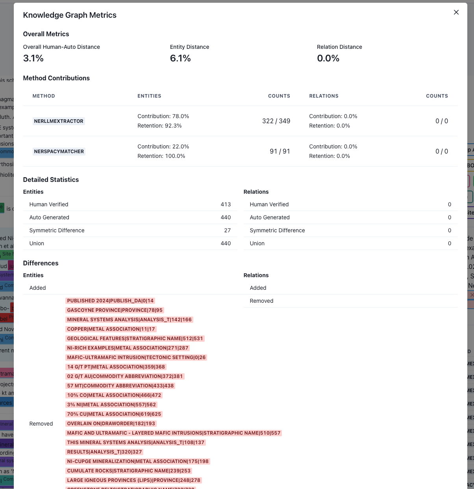

# Docs2KG

**A Human-LLM Collaborative Approach to Unified Knowledge Graph Construction from Heterogeneous Documents**

[](./docs/files/Docs2KG.v2.pdf)

[](https://docs2kg.ai4wa.com/Video/)


## Installation

We have published the package to PyPi: [Docs2KG](https://pypi.org/project/Docs2KG/),

You can install it via:

```bash
pip install Docs2KG
```

---



## Motivation

To digest diverse unstructured documents into a unified knowledge graph, there are two main challenges:

- **How to get the documents to be digitized?**
    - With the dual-path data processing
        - For image based documents, like scanned PDF, images, etc., we can process them through the layout analysis and
          OCR, etc. Docling and MinerU are focusing on this part.
        - For native digital documents, like ebook, docx, html, etc., we can process them through the programming parser
    - It is promising that we will have a robust solution soon.
- **How to construct a high-quality unified knowledge graph with less effort?**

For now, a lot of tools are focusing on the first challenge, however, overlook the second challenge.

To construct a high-quality unified knowledge graph with less effort, we propose the Docs2KG.

- We adapt both bottom-up and top-down approaches to construct the unified knowledge graph and its ontology with the
  help of LLM.
- We organise the knowledge graph from three aspects:
    - MetaKG: the knowledge about all documents, like the author, the publication date, etc.
    - LayoutKG: the knowledge about the layout of the documents, like title, subtitle, section, etc.
    - SemanticKG: the knowledge about the content of the documents, like entities, relations, etc.
- We provide a human-LLM collaborative interface which allows human to review and enhance the generated knowledge graph.
    - An updated version of ontology, entity list, relation list will in return help the KG Construction LLM agent to
      generate better results in the next iteration.
    - The output of the knowledge graph can be used in downstream applications, like RAG, etc.
    - Link for the human-LLM collaborative interface: [Docs2KG](https://docs2kg.kaiaperth.com/)
    - After the annotation, metrics to evaluate the quality of automatic construction will be provided.
        - How many entities are correctly extracted by each method?
        - How many relations are correctly extracted by each method?
        - Contribution and retention of each method in the final knowledge graph, including human annotation.

Example of the interface, you only need to register, and you can access it freely.




---

## Setup and Development

```bash
python3 -m venv venv
source venv/bin/activate
pip install -r requirements.txt
pip install -r requirements.dev.txt

pip install -e .
```

---

## Citation

If you find this package useful, please consider citing our work:

```bibtex
@misc{sun2024docs2kg,
    title = {Docs2KG: Unified Knowledge Graph Construction from Heterogeneous Documents Assisted by Large Language Models},
    author = {Qiang Sun and Yuanyi Luo and Wenxiao Zhang and Sirui Li and Jichunyang Li and Kai Niu and Xiangrui Kong and Wei Liu},
    year = {2024},
    eprint = {2406.02962},
    archivePrefix = {arXiv},
    primaryClass = {cs.CL}
}
```