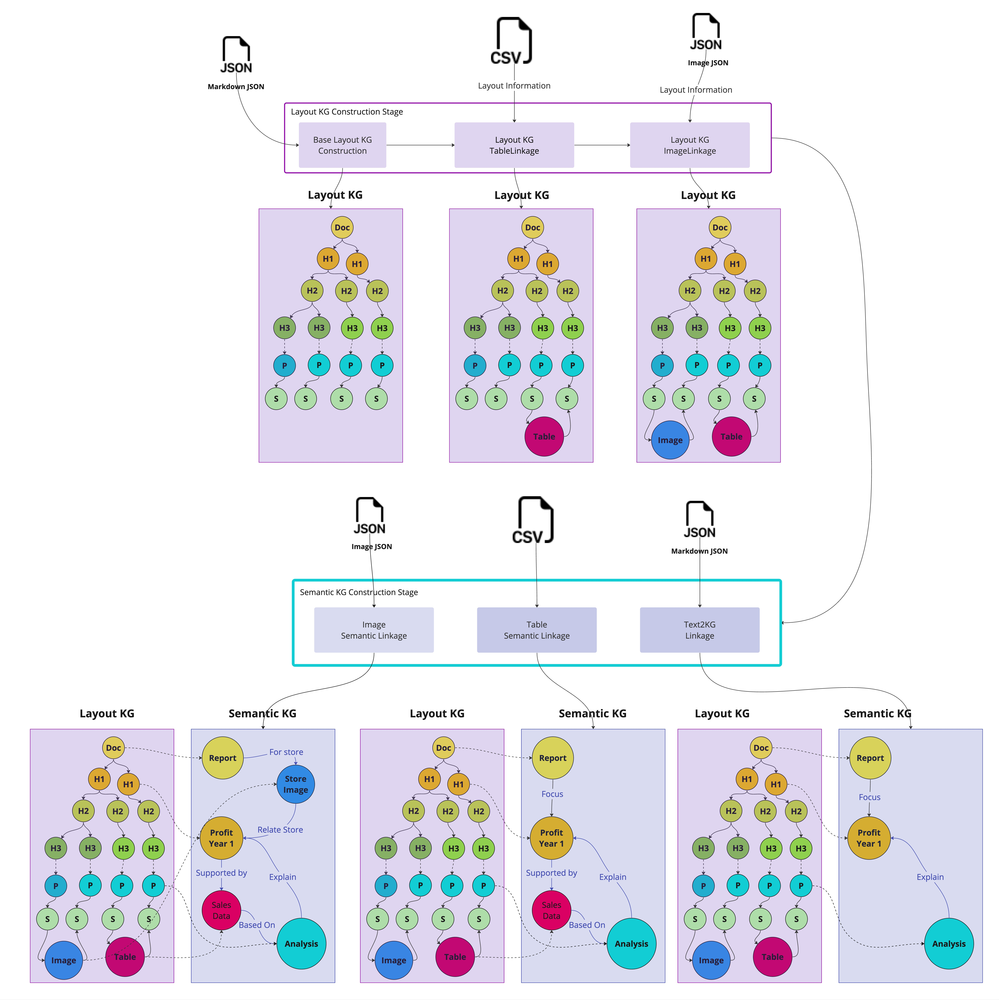

# Open Source Framework: Docs2KG

**Unified Knowledge Graph Construction from Heterogeneous Documents Assisted by Large
Language Models**


[](https://docs2kg.ai4wa.com/Video/)


Three pillars of the LLM applications in our opinion:

- Data
- RAG
- LLM

Most of the tools in the market nowadays are focusing on the Retrieval Augmented Generation (RAG) pipelines or
How to get Large Language Models (LLMs) to run locally.

However, to make sure the wider community can benefit from the latest research, we need to first solve the data problem.

The Wider community includes personal users, small business, and even large enterprises.
Some of them might have developed databases, while most of them do have a lot of data, but they are all in unstructured
form, and distributed in different places.

So the first challenges will be:

- How can we easily process the unstructured data into a centralized place?
- What is the best way to organize the data within the centralized place?

## Proposed Solution

This package is a proposed solution to the above challenges.

- We developed the tool for the wider community to easily process the unstructured data into a centralized place.
- We proposed a way to organize the data within the centralized place, via a Unified Knowledge Graph altogether with
  semi-structured data.

### Overall Architecture

The overall workflow will be:


## System Architecture


### PDF

The Main data under this category is PDF.

So we need to be able to extract the text and images from the PDF.

## Unified Knowledge Graph



## Setup

```bash
python3 -m venv venv
source venv/bin/activate
pip install -r requirements.txt
pip install -r requirements.dev.txt

pip install -e .
```
