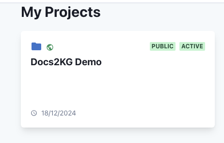
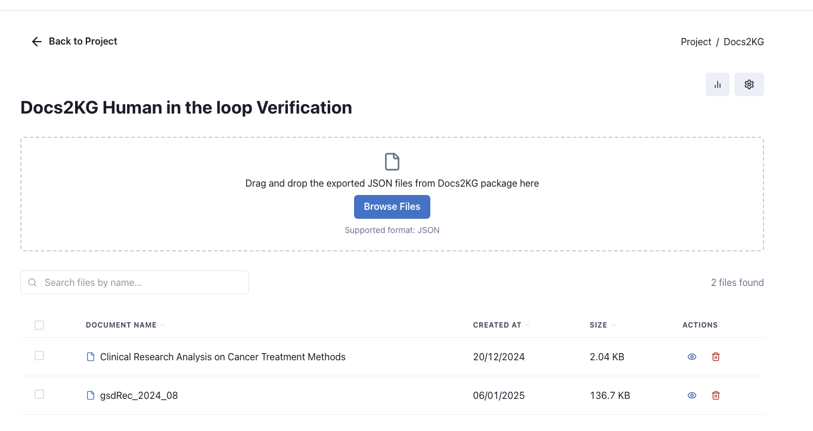
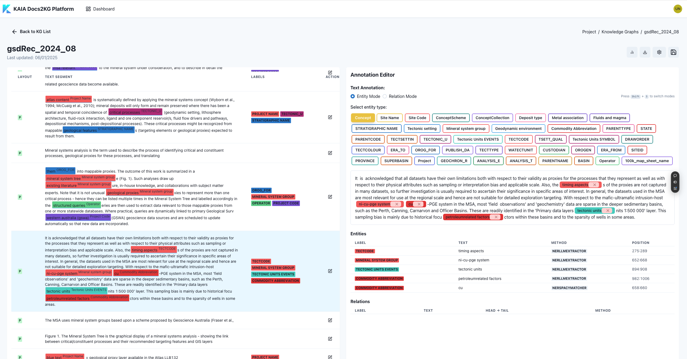
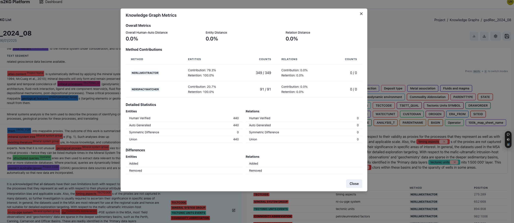
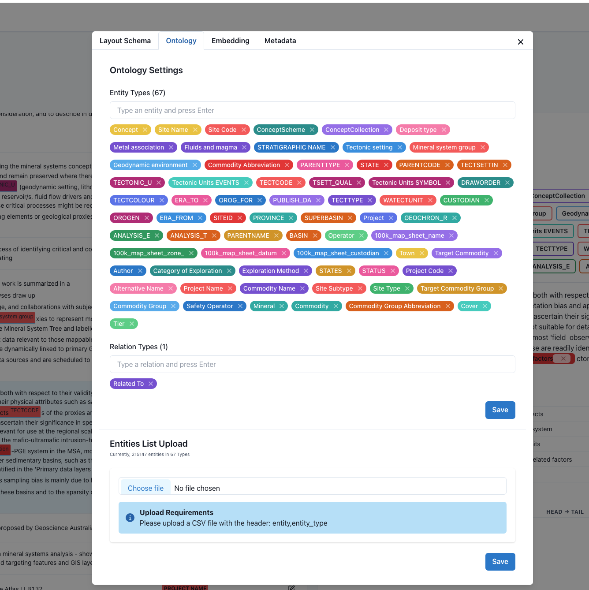

# How to use Docs2KG Interface?

It is freely accessible via: [Docs2KG Interface](https://docs2kg.kaiaperth.com/).

You can register freely and then login with your account.

## Demo Project

To view and have a try, you can see our demo public project:

Click it and then go to Docs2KG application.

You will be able to view this and upload the generated json from Docs2KG package.

Open the uploaded file by click the 'eye' icon, you will be able to start the edit

You can add/remove entities and relations, and then save the changes, download the updated json file.

After you finish the annotation, you can also view the metrics of the Doc2KG package and annotation.

You can also add/remove entity types and relation types in the ontology, also upload the entity list by click the
setting icon.

---

## Your Own Project

In Dashboard, create a project, give it a name and then make it private.

Then you can upload the json file generated from Docs2KG package.

Do similar things as the demo project, you will be able to have a clean and clear knowledge graph.
