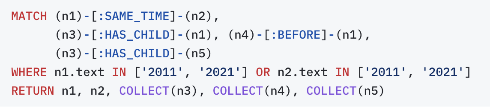
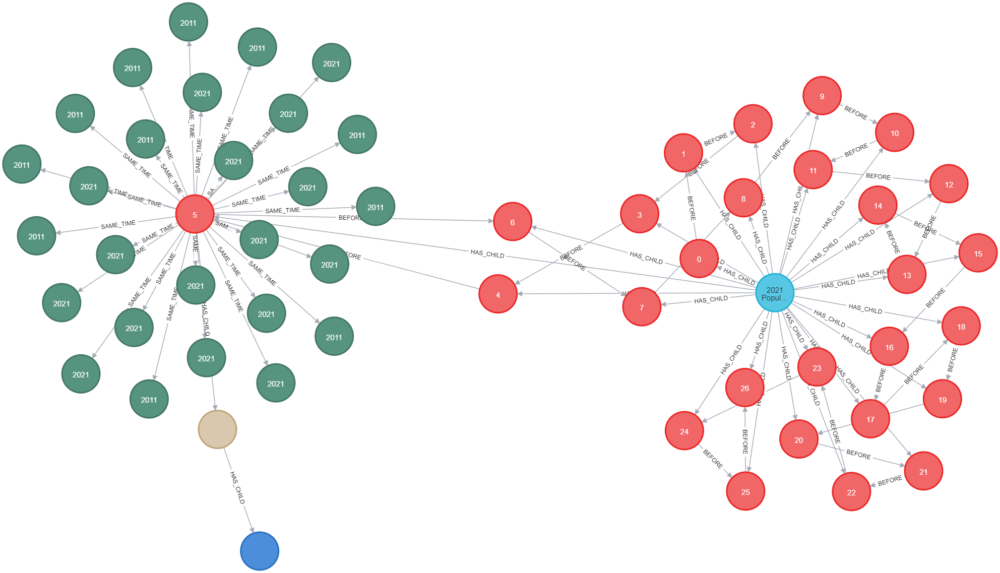

# How to use the unified multimodal knowledge graph in downstream applications?

To use a unified multimodal knowledge graph in downstream applications, typically there are two ways:

- **Querying the KG** with Cypher or SPARQL
- **Vector Based RAG**

## Querying the KG

We have the schema and data rest in the KG, traditionally, we can use Cypher or SPARQL to query the KG.

With the advance of the LLM, we can also use the NLP query to Cypher Query.

First, we need to convert the NLP query into the Cypher Query.

Then we can use the Cypher Query to query the KG.

This is quite a standard way, we provide example in our paper.

All you need is the interface to run the query in Neo4j.

For example if we asked the query for the document we processed earlier:

```text
Can you show me all documents and their components related to events that occurred in the years 2011 and 2021?
```

We can create a cypher query like this:



And we will have the result like this:



## Vector Based RAG

Another way is to embed all the content and metadata of each node.
When a new query comes in, we can embed the query and do the similarity search to extract the anchor nodes within the
graph.

Then we can use these nodes as the anchor nodes, doing multi hop information extraction to augment the query.

Finally, we can use the LLM to do the final generation based on the augmented query.

The strategy to extract relevant information from the KG can not limit to the multi hop information extraction,
you can also design your own information extraction strategy based on the specific task, for example, embedding based
BFS or DFS.

So the same NLP query like above, we will have a cypher query like this after similarity match:

```cypher
MATCH (startNode)-[*1..3]->(endNode)
WHERE startNode.uuid IN ['17da8cc5-9986-4126-8752-545162ca6aa7', 'dae828f5-e968-49a7-bf03-0a9a81022434', '2cc13873-9bce-45ed-a0a3-df9765e90579', '32eb0955-b983-446f-b883-db575f304f88', 'd6735d2d-afa0-41c0-842b-c1ecb9a4b4d5', '503e64f8-1a22-44b2-be99-240578925c1f', '1b2fe6fb-2949-40ce-9ba1-61496f164a67', '1a0e5f3a-b250-442d-afc2-1f139a367e21', 'c632fceb-3af9-4b11-9082-3ce615d1fd5b', '29544460-0135-46e9-94f5-60c2b86caa53']
RETURN endNode
```

Output will be like this:

